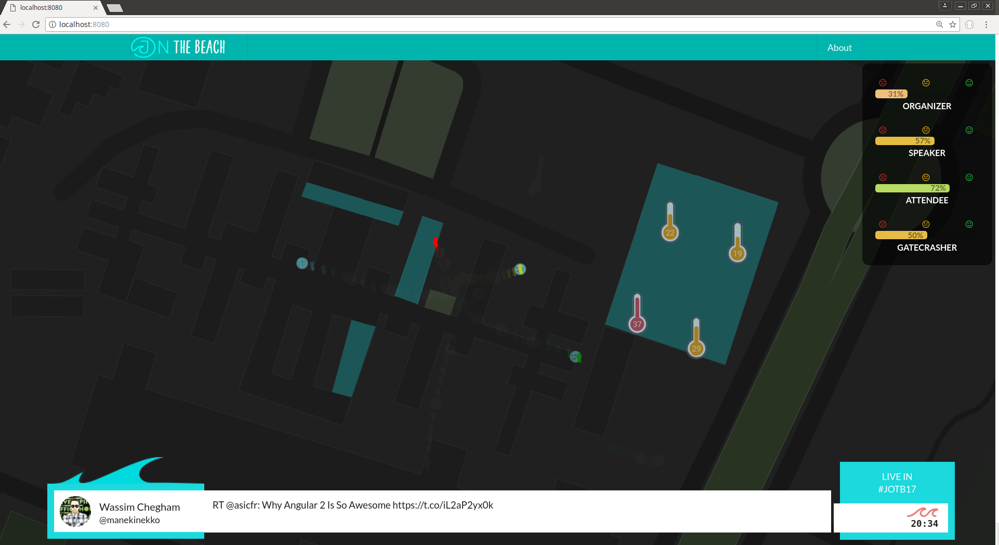

# Hackathon @ J On The Beach 2017

This is the repository for the Valo [Hackathon](https://jonthebeach.com/hackathon) and [J On The Beach 2017](https://jonthebeach.com/).

The purpose of the hackathon is *hacking the J On The Beach conference*. In order to do so, we will use [Valo](https://valo.io/) as the core real-time analytics engine. We will feed Valo from IoT and mobile devices. Then we will create data visualizations that help us get insights about J On The Beach itself. 

## Documentation and Tutorials

Below you will see a quick [Getting started]() section. Find extended documents and tutorials in the [Wiki](https://github.com/ITRS-Group/hackathon2017/wiki). 

## How to contribute

1. Fork this repository.

2.  Make a **pull request**  targeted to this repo's *master* branch 

## Repo organization

Under `valo/` we put all the code (examples, helpers) and documentation created by Valo for the participants to use.

Under `teams/` we will put all the code, documentation and presentations created by the Hackathon teams. 

## Getting started

### Requirements
You will need to have installed in your environment:

- A **[Git](https://git-scm.com/)** client.

- **Java Run Environment**. Valo needs version: `1.8.0_131`  to run smoothly. [Download it here](http://www.oracle.com/technetwork/java/javase/downloads/jdk8-downloads-2133151.html)

- **[NodeJS](https://nodejs.org/es/)**. The running environment for javascript outside a web browser. 

- **[Babel](https://babeljs.io/)**. A transpiler from Ecmascript2015 and beyond to Ecmascript5. Our examples and code use the latest elegant flavor of Javascript and need this! Although it is installed locally in our local hackathon repository, it is convenient to have it installed globally in our system.
~~~shell
$ npm i --global babel-cli babel-present-env
~~~

- One of the following alternatives for sending HTTP requests:
	- **[Curl](https://curl.haxx.se/dlwiz/?type=bin)**. The command line tool for sending and receiving HTTP.

	- **[Advanced Rest Client](https://advancedrestclient.com/)**. A GUI alternative to *Curl*.

- (Optional) **[Wireshark](https://www.wireshark.org/)** for capturing and analyzing HTTP traffic.

- Clone this repository in your computer and install its dependencies:
~~~shell
$ git clone https://github.com/ITRS-Group/hackathon2017.git

$ npm install
~~~

- **[Valo](https://valo.io/)**. Download from [here](http://zen.itrsgroup.com/l/81822/2017-05-12/4d61g8). Go to [Getting Started](https://valo.io/docs/current/Valo/getting_started/get_start_links.html) and install it.

### Run stuff
There are different parts of the Hackathon's base scenario that must be launched, preferably in order.

1. Run **Valo**

2. Create **contributors and streams** in Valo. 

3. Start data contributors. They inject data (events) into Valo:
	1. **Simulator**
	2. **Twitter feed**
	3. **Mobile application**
	4. **MQTT feed**
	
4. Run data visualizations. They query Valo and visualize data from the processed stream they receive as input:
	1. **Web browser visualization**
	2. **Philps Hue visualization**

#### Run Valo

For running **Valo**, see instructions at [Getting Started](https://valo.io/docs/current/Valo/getting_started/run_valo.htm). 

#### Create contributors and streams
When running things for the 1st time, we need to create the streams and contributors in Valo. The following script assumes you are running a Unix shell. If not, inspect the target shell script and run the curl commands it contains.

1. From the root of this repository:
~~~shell
$ npm run createAllStreamsAndContributors 
~~~
2. If you are curious or run into trouble, inspect the master `package.json`file at the root of the repository to see what script you are starting with the command above:
~~~shell
$ grep createAllStreamsAndContributors package.json 
    "createAllStreamsAndContributors": "cd valo/doc/interfaces && sh create_all_contributors_and_streams.sh; cd -"
~~~

#### Start the simulator
The simulator injects fake events into Valo, from fake users using the mobile application. There are two types of events: user location and user rating of the event.

1. From the root of this repository:
~~~shell
$ npm run launch:simulator
~~~
2. If you are curious or run into trouble, inspect the master `package.json`file at the root of the repository to see what script you are starting with the command above:
~~~shell
$ grep "launch:simulator" package.json 
    "launch:simulator": "babel-node valo/src/simulator_js/bin/main.js",
~~~

#### Start the Twitter feed
This starts a script that listens to a Twitter stream and publishes the events into Valo.

1. You need a Twitter account. 

2. Create a new Twitter app within your Twitter account at: https://apps.twitter.com/

3. From the Twitter app page, get *consumer key*, *consumer secret*, *access token* and *access token secret*. (You may have to generate them).

4. Export the 4 values items as *environment variables*. This depends on your operating system. In a Unix shell:
~~~shell
export TWITTER_CONSUMER_KEY='your_consumer_key'
export TWITTER_CONSUMER_SECRET='your_consumer_secret'
export TWITTER_ACCESS_TOKEN_KEY='your_access_token'
export TWITTER_ACCESS_TOKEN_SECRET='your_access_token_secret'
~~~

5. Make sure your current command line terminal has *sourced* the new environment variables.

6. Run the Twitter feed script. From the root of this repository:
~~~shell
$ npm run launch:twitter
~~~
7. If you are curious or run into trouble, inspect the master `package.json`file at the root of the repository to see what script you are starting with the command above:
~~~shell
$ grep launch:twitter package.json 
   "launch:twitter": "babel-node valo/src/twitter_js/bin/main.js",
~~~

#### Run the mobile application
The mobile application allows a user to register as a *mobile contributor* in Valo, and then it periodically sends the user location and, upon user request, the user rating (*happiness level*).

1. Install [IonicView](http://view.ionic.io/) in your mobile phone.

2. Sign up if you do not have a IonicView account yet.

3. Launch IonicView in your mobile.

4. View the application with code: `9ed6fcee`. 

#### Run the MQTT to Valo bridge
Some of the IoT board may publish events to a MQTT server like `mqtt://iot.eclipse.org`. The *MQTT to Valo bridge* is a script that subscribes to certain channels of the MQTT server and relays the events to a Valo stream.

1. Run the MQTT-to-Valo script:
~~~shell
$ npm run launch:transport
~~~
2. If you are curious or run into trouble, inspect the master `package.json`file at the root of the repository to see what script you are starting with the command above:
~~~shell
$ grep launch:transport package.json 
    "launch:transport": "babel-node valo/src/transport_to_valo_bridge_js/bin/main.js",
~~~

#### Run web browser visualization
The example web visualization displays data gathered from the mobile application (real or simulated), the surfboards (real or simulated) and the Twitter feed.

1. Build the web visualization
~~~shell
$ npm run make:viz
~~~

2. Start serving the visualization:
~~~shell
$ npm run launch:viz
~~~

3. Browse the visualization from your web browser at `http://127.0.0.1:8080/`

4. As above, inspect `package.json`if you run into trouble or want to understand what is happening under the hood.

#### Run the Philips Hue visualization
You should have set up the lightbulbs and the Philips Hue bridge. See the [Wiki](https://github.com/ITRS-Group/hackathon2017/wiki) for specific information.

1. Run the lightbulbs visualization
~~~shell 
$ npm run launch:lights
~~~

## People 

### The organizers

Yara Senger, Vinicius Senger, Alvaro Santamaria

### The assistants

Danilo Rossi, Zuri Pabón, Andrés Ramírez, Andras Kecskes

### Contributors

Contributed to the preparation of the Hackathon (coding and documenting):

**Documentation and design**: Angela Dini, Paul Baxter,  Katharine Murphy

**IoT devices** : David Torelli, Rémi Selva, Francisco Parada, David Sobieplan

**Mobile application**:  Leo Andre Namuco

**Visualizations**: Danilo Rossi, Zuri Pabón, Andrés Ramírez, Javier Latorre

### Participants

