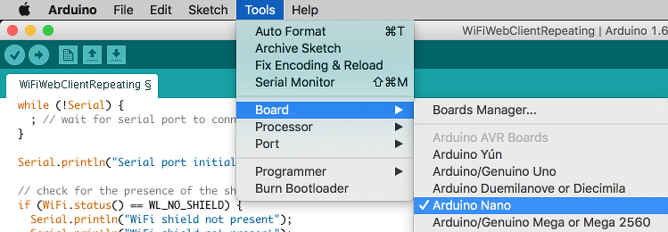
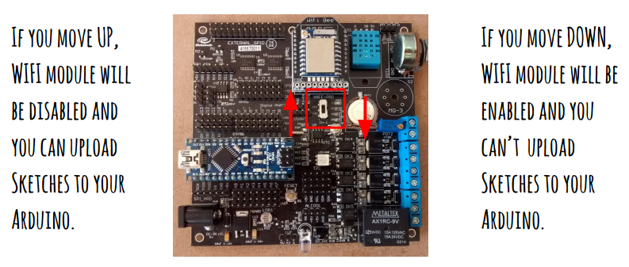

# JOTB Hackathon 2017 Development Framework
This document describes the setup of your development framework for the JOB Hackathon 2017.

To make it easier for you, we have place all the relevant documentation tools, libraries and exmples in this [git repository](https://github.com/ITRS-Group/hackathon2017.git).


Press the blue `Download` button at the right side of the screen and choose `Download Zip` option.

Decompress the file in your user folder and follow the instructions of the installation guide.

## Install the USB to Serial driver
Please, install the driver (regarding your OS) to communicate your computer with the Surfboard.

| OS Version | File | Link |
|------------|------|------|
|Windows     |      |      |
|Linux       |      |      |
|OS X Sierra |[driver](CH34x_Install/OS\ X/CH34x_Install_V1.3.pkg)|[instructions](http://www.mblock.cc/posts/run-makeblock-ch340-ch341-on-mac-os-sierra)|
|OS X (older)|[driver](CH34x_Install/OS\ X/CH34x_Install.pkg)|[instructions](CH34x_Install/OS\ X/ReadMe.pdf)|

## Install the Arduino IDE
There are several frameworks to work with Arduino, but we recommend the Arduino IDE for a fast setup.

Download and install the [Arduino IDE 1.6.2](https://www.arduino.cc/en/Main/OldSoftwareReleases#previous) according to your operating system.

> Please note that Surfboard works with version [1.6.2](https://www.arduino.cc/en/Main/OldSoftwareReleases#previous).

Now you are ready to setup your Surfboard!

## Surfboard and tools setup
We will need to verify that both the Surfboard hardware and IDE are properly configured.

### Arduino IDE
Open the Arduino IDE and add the libraries and configure the conection with the Surfboard.

#### Adding libraries
You will need to add the Surfboard libraries before you start coding.

##### Adding libraries the easy way
First of all copy the Arduino folder at `userhome/Documents` in `Un*x` systems and under `My Documents` under Windows OS. This should add the libraries automatically. 

##### Adding libraries manually
If libraries are not listed under menu `Sketch > Include libraries` in your Arduino IDE, you can add them manually by opening `Sketch > Include libraries > Add .ZIP library` from the menu and select the directories under `Arduino/libraries`.


##### Verifying bridge library installation
Verify that `bridge library` is also installed. You can do this through the menu `Sketch > Include libraries > Manage libraries`. 


If it is not installed, please do it by selecting the latest version from the dropdown. After the installation the label INSTALLED will appear in the library header.


#### Setup surfboard connection
Connect the Surfboard to your PC/MAC and open Arduino IDE and check in your computer that the Surfboard serial communication port is available (e.g. in windows COMx).
From the menu, select:

1. `Tools` > `Board` > `Arduino Nano`

2. `Tools` > `Processor` > `ATmega328`

3. `Tools` > `Port` > `###` The port where your Surfboard is connected to (e.g. COM4).


### Hardware configuration
Wifi and uploading functionality are not available at the same time (see picture below). That means that you need to set the switch when you need to upload your program, and you will need to change the switch after the program is uploaded so that the Wifi is enabled.




## Hello IoT!
Let's move on and write our first IoT application.

Create a new Arduino project. You will see that a page appears showing two methods: setup and loop.

### Setup
In the setup method you have to define the configuration ports of the Surfboard considering the devices (Wifi, Serial, ...) / GPIOs (Leds, ...) you need for your program.

```
void setup() {
  // initialize serial communication at 9600 bits per second:
  Serial.begin(9600);
}
```

### Main loop
In the main loop you write the logic of your application. It is easier if you model your application based on events as a state machine to facilitate the handling of concurrence in absence of multithreading.
> Note: Think that most embedded systems does not multiprocessing capabilities.

```
void loop() {
  // put your main code here, to run repeatedly:
  Serial.println("Hello IoT");
  delay(1000);
}
```

### Debugging
Println is the way to debug in your Arduino IDE. You can show a terminal to debug your first hello world application.

## And now what? ...
Now that you have successfully build your first application, have a look at the Valo contributor [example]() and open a world of possibilities.